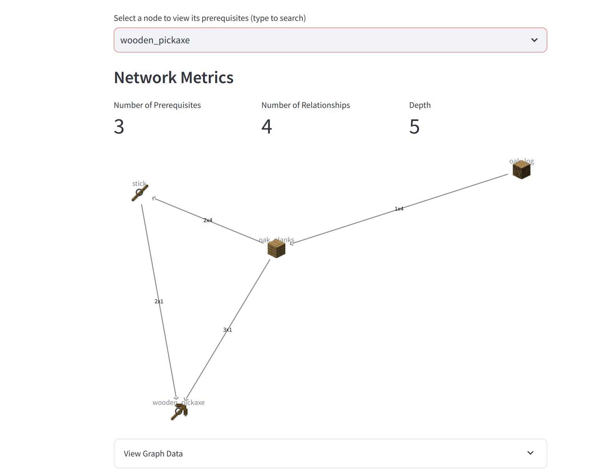
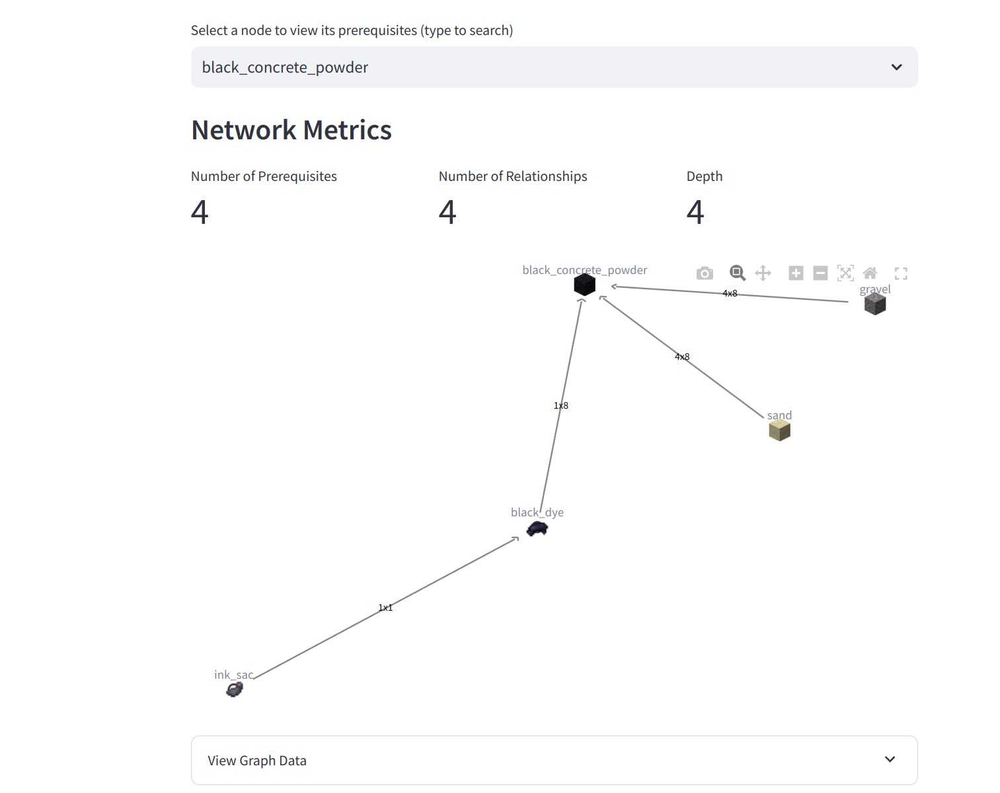

# minecraft-recipe-visualizer
This repository includes the code for building a streamlit app that can help visualize the item crafting recipes for ALL items in minecraft.

Below are some images which show how the graph for crafting recipe graph for each item is built and displayed.

